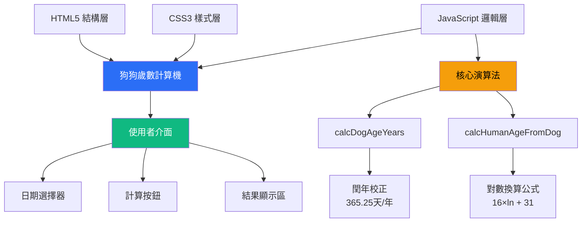
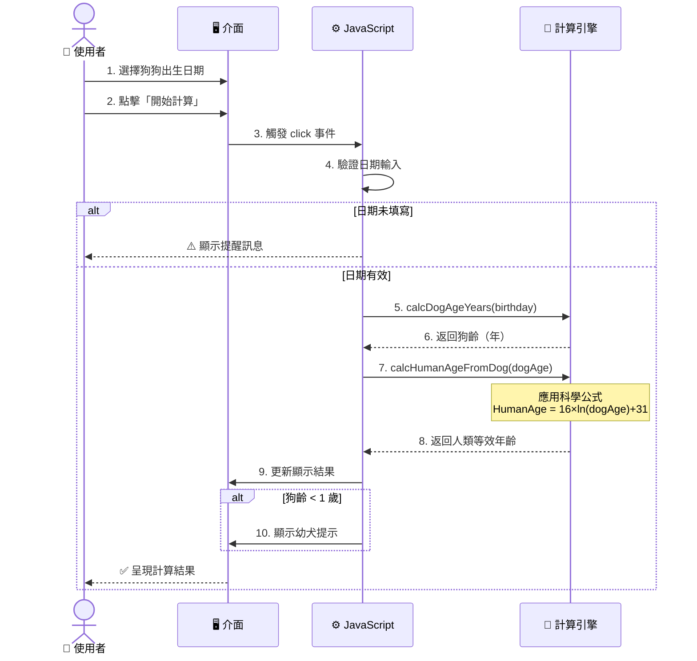
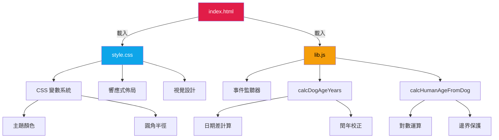
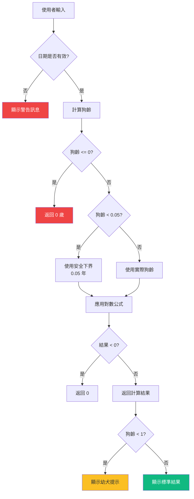
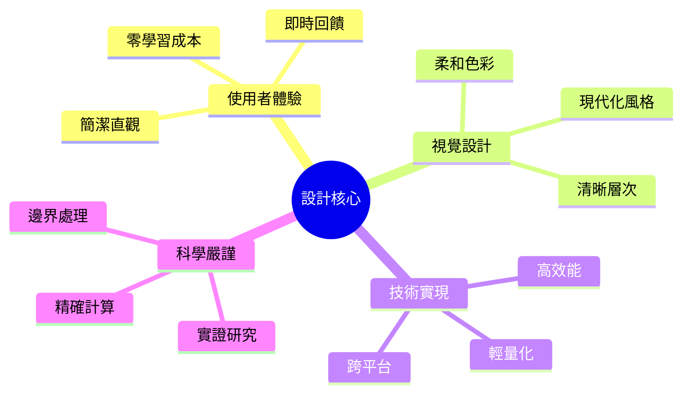

# 🐶 狗狗歲數計算機

[](https://opensource.org/licenses/MIT)
[](https://developer.mozilla.org/en-US/docs/Web/HTML)
[](https://developer.mozilla.org/en-US/docs/Web/CSS)
[](https://developer.mozilla.org/en-US/docs/Web/JavaScript)

一款基於科學研究的狗狗年齡換算工具，採用 **Cell Systems** 期刊發表的 DNA 甲基化研究公式，精準換算狗齡與人類年齡。

## 📋 目錄

- [專案簡介](#-專案簡介)
- [核心特色](#-核心特色)
- [技術架構](#-技術架構)
- [系統流程](#-系統流程)
- [科學原理](#-科學原理)
- [快速開始](#-快速開始)
- [檔案結構](#-檔案結構)
- [使用說明](#-使用說明)
- [技術細節](#-技術細節)
- [參考文獻](#-參考文獻)
- [授權協議](#-授權協議)

## 🎯 專案簡介

本專案提供一個簡潔優雅的網頁介面，讓寵物飼主能夠科學地換算狗狗的實際年齡。不同於傳統「狗齡×7」的粗略算法，本計算機採用 **Wang et al. (2019)** 在《Cell Systems》發表的研究成果，透過 DNA 甲基化模式建立的對數換算公式，提供更精確的年齡對應關係。

### 核心換算公式

$$
\text{HumanAge} = 16 \times \ln(\text{DogAge}) + 31
$$

其中：
- **HumanAge**：等效的人類年齡（歲）
- **DogAge**：狗狗實際年齡（歲）
- **ln**：自然對數（Natural Logarithm）

## ✨ 核心特色

- 🔬 **科學驗證**：基於 DNA 甲基化研究的實證公式
- 🎨 **優雅設計**：現代化 UI/UX，響應式佈局
- ⚡ **即時計算**：毫秒級運算，無需伺服器
- 🌐 **無依賴**：純原生 JavaScript，零外部套件
- 📱 **跨平台**：支援所有現代瀏覽器與行動裝置
- 🛡️ **邊界處理**：完善的輸入驗證與極端值保護
- 🌏 **中文友善**：完整繁體中文介面

## 🏗️ 技術架構



## 🔄 系統流程



## 🔬 科學原理

### 研究背景

傳統的「一狗齡等於七人類年」說法過於簡化，無法反映狗狗在不同生命階段的真實發育速率。Wang et al. 的研究團隊透過分析 104 隻拉布拉多犬（年齡從 0 至 16 歲）的基因組 DNA 甲基化模式，建立了更精確的對數換算模型。

### 公式解析


**對數特性**：
- 幼犬時期成長快速 → 人類年齡增長迅速
- 成年後老化趨緩 → 曲線逐漸平緩
- 符合生物學實際發育曲線

### 年齡對照表

| 狗齡（年） | 人類年齡（歲） | 生命階段 |
|-----------|---------------|---------|
| 0.5       | 20.9          | 幼犬期   |
| 1         | 31.0          | 青少年期 |
| 2         | 42.1          | 成年期   |
| 5         | 56.8          | 中年期   |
| 10        | 67.8          | 老年期   |
| 15        | 74.3          | 高齡期   |

## 🚀 快速開始

### 環境需求

- 任何現代網頁瀏覽器（Chrome 90+, Firefox 88+, Safari 14+, Edge 90+）
- 無需安裝額外依賴或套件

### 安裝步驟

1. **克隆專案**
```bash
git clone https://github.com/dpi627/HexVC3DailyTask08.git
cd HexVC3DailyTask08
```

2. **開啟應用**

直接雙擊 `index.html` 或使用本地伺服器：

```bash
# 使用 Python 3
python -m http.server 8000

# 使用 Node.js (需安裝 http-server)
npx http-server -p 8000
```

3. **瀏覽器訪問**
```
http://localhost:8000
```

## 📁 檔案結構

```
HexVC3DailyTask08/
├── 📄 index.html          # 主要 HTML 結構
├── 🎨 style.css           # 樣式表（CSS 變數、響應式設計）
├── ⚙️ lib.js              # 核心邏輯（計算引擎）
└── 📖 README.md           # 專案文檔（本檔案）
```

### 架構圖



## 📖 使用說明

### 基本操作

1. **選擇日期**：點擊日期選擇器，輸入或選擇狗狗的出生日期
2. **執行計算**：點擊「開始計算」按鈕
3. **查看結果**：系統將顯示：
   - 狗狗的實際年齡（精確到小數點後一位）
   - 對應的人類等效年齡
   - 特殊提示（如幼犬註記）

### 特殊情況處理



## 🔧 技術細節

### 核心演算法

#### 1. 狗齡計算 (`calcDogAgeYears`)

```javascript
function calcDogAgeYears(birthISODate) {
  const birth = new Date(birthISODate);
  const today = new Date();
  const msPerYear = 1000 * 60 * 60 * 24 * 365.25; // 閏年校正
  const years = Math.max(0, (today - birth) / msPerYear);
  return years;
}
```

**技術亮點**：
- 使用 `365.25` 天/年，精確處理閏年
- `Math.max(0, ...)` 防止未來日期產生負值

#### 2. 人類年齡換算 (`calcHumanAgeFromDog`)

```javascript
function calcHumanAgeFromDog(dogAge) {
  if (dogAge <= 0) return 0;
  
  const safeDogAge = Math.max(dogAge, 0.05); // 下界保護：約 18 天
  const humanAge = 16 * Math.log(safeDogAge) + 31;
  
  return Math.max(0, humanAge); // 上界保護
}
```

**技術亮點**：
- `Math.log()` 計算自然對數（ln）
- 安全下界（0.05 年）避免極端負值
- 雙重邊界檢查確保輸出合理性

### CSS 架構特色

- **CSS 變數系統**：集中管理主題色彩與樣式
- **漸層美學**：按鈕與卡片使用精緻漸層效果
- **盒陰影層次**：多層陰影營造立體感
- **平滑過渡**：hover 效果採用 `transition` 動畫

### 響應式設計

```css
.container {
  max-width: 560px;
  margin: 0 auto;
  display: grid;
  gap: 18px;
}
```

- Grid 佈局自動適應螢幕寬度
- 行動裝置友善的觸控目標尺寸
- 字體採用系統原生字型堆疊

## 📚 參考文獻

Wang, T., Ma, J., Hogan, A. N., Fong, S., Licon, K., Tsui, B., ... & Ideker, T. (2020). **Quantitative translation of dog-to-human aging by conserved remodeling of the DNA methylome**. *Cell Systems*, 11(2), 176-185.

🔗 [https://doi.org/10.1016/j.cels.2019.12.003](https://doi.org/10.1016/j.cels.2019.12.003)

### 研究侷限

- 樣本主要基於拉布拉多犬，不同品種可能有差異
- 小型犬與大型犬的壽命與老化速率不同
- 公式為統計模型，個體差異需考量

## 🎨 設計理念



## 🛠️ 未來展望

- [ ] 支援不同犬種的換算係數調整
- [ ] 新增貓咪年齡計算功能
- [ ] 提供年齡曲線視覺化圖表
- [ ] 多語言介面（英文、日文）
- [ ] PWA 支援（離線使用）
- [ ] 深色模式切換

## 👨‍💻 開發者

**dpi627** - 全端開發

## 📄 授權協議

本專案採用 **MIT License** 授權。

---

<div align="center">

Made with ❤️ and 🐶

**[⬆ 回到頂部](#-狗狗歲數計算機)**

</div>
