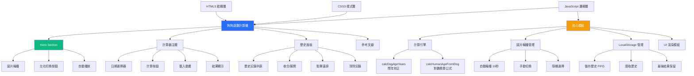
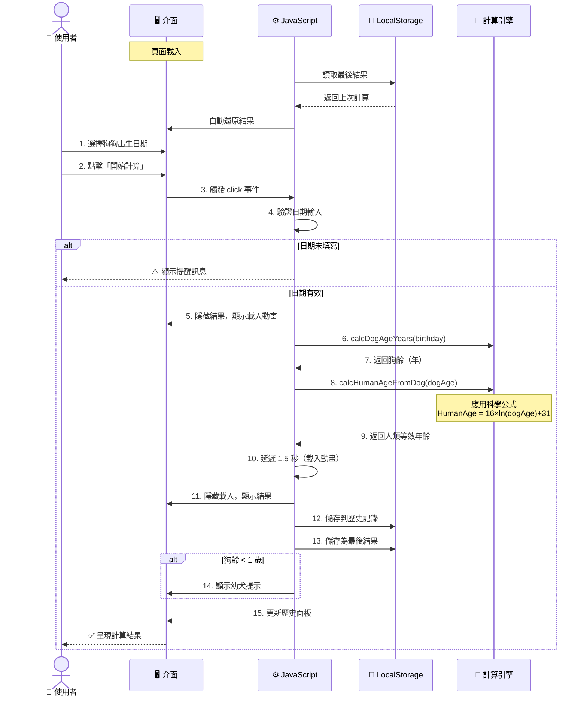
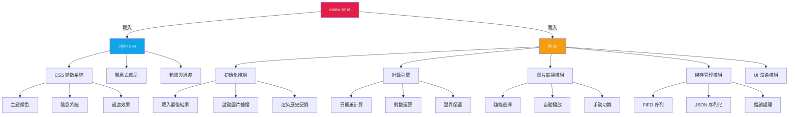
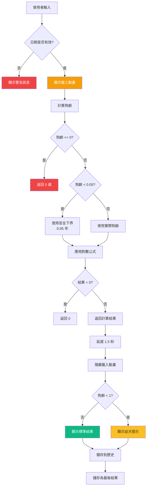
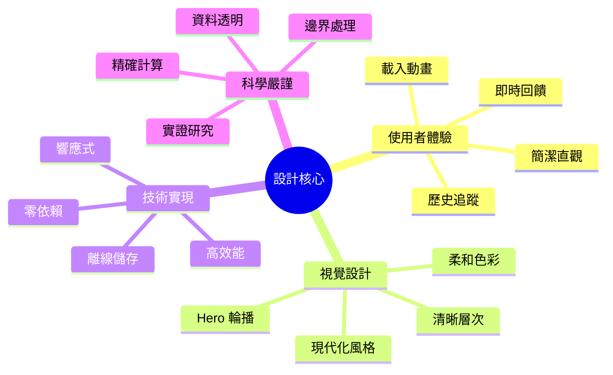

# 🐶 狗狗歲數計算機

[](https://opensource.org/licenses/MIT)
[](https://developer.mozilla.org/en-US/docs/Web/HTML)
[](https://developer.mozilla.org/en-US/docs/Web/CSS)
[](https://developer.mozilla.org/en-US/docs/Web/JavaScript)

一款基於科學研究的狗狗年齡換算工具，採用 **Cell Systems** 期刊發表的 DNA 甲基化研究公式，精準換算狗齡與人類年齡。具備現代化 UI/UX 設計、圖片輪播、計算歷史記錄等豐富功能。

## 📋 目錄

- [專案簡介](#-專案簡介)
- [核心特色](#-核心特色)
- [技術架構](#-技術架構)
- [系統流程](#-系統流程)
- [科學原理](#-科學原理)
- [快速開始](#-快速開始)
- [檔案結構](#-檔案結構)
- [使用說明](#-使用說明)
- [技術細節](#-技術細節)
- [參考文獻](#-參考文獻)
- [授權協議](#-授權協議)

## 🎯 專案簡介

本專案提供一個現代化、優雅的網頁介面，讓寵物飼主能夠科學地換算狗狗的實際年齡。不同於傳統「狗齡×7」的粗略算法，本計算機採用 **Wang et al. (2019)** 在《Cell Systems》發表的研究成果，透過 DNA 甲基化模式建立的對數換算公式，提供更精確的年齡對應關係。

### 核心換算公式

$$
\text{HumanAge} = 16 \times \ln(\text{DogAge}) + 31
$$

其中：
- **HumanAge**：等效的人類年齡（歲）
- **DogAge**：狗狗實際年齡（歲）
- **ln**：自然對數（Natural Logarithm）

## ✨ 核心特色

### 🔬 科學驗證
- 基於 DNA 甲基化研究的實證公式
- 精確的對數換算模型
- 符合生物學實際發育曲線

### 🎨 現代化設計
- 優雅的 UI/UX 介面
- Hero Section 圖片輪播（5 張精選狗狗照片）
- 手動切換按鈕 + 自動輪播（每 10 秒）
- 平滑動畫與過渡效果
- 載入動畫提升使用者體驗

### 💾 智慧儲存
- LocalStorage 計算歷史記錄（最多 10 筆）
- 最後一次計算結果自動保留（重新整理不消失）
- 時間戳記追蹤每次計算
- 點擊歷史項目快速還原
- 一鍵清除所有記錄

### 📱 響應式設計
- 完整支援桌面、平板、手機
- 彈性佈局自動適應螢幕尺寸
- 觸控友善的互動元素
- 三個斷點精細調整（1024px, 768px, 480px）

### ⚡ 效能優化
- 零外部依賴，純原生 JavaScript
- 毫秒級運算速度
- CSS Transform 硬體加速動畫
- 圖片輪播預載優化

### 🛡️ 完善設計
- 輸入驗證與錯誤處理
- 邊界值保護（避免極端計算結果）
- 無障礙設計（ARIA 標籤支援）
- 幼犬特殊提示訊息

### 🌏 中文友善
- 完整繁體中文介面
- 清晰的說明文字
- 本地化日期格式

## 🏗️ 技術架構



## 🔄 系統流程



## 🔬 科學原理

### 研究背景

傳統的「一狗齡等於七人類年」說法過於簡化，無法反映狗狗在不同生命階段的真實發育速率。Wang et al. 的研究團隊透過分析 104 隻拉布拉多犬（年齡從 0 至 16 歲）的基因組 DNA 甲基化模式，建立了更精確的對數換算模型。

### 公式解析


**對數特性**：
- 幼犬時期成長快速 → 人類年齡增長迅速
- 成年後老化趨緩 → 曲線逐漸平緩
- 符合生物學實際發育曲線

### 年齡對照表

| 狗齡（年） | 人類年齡（歲） | 生命階段 |
|-----------|---------------|---------|
| 0.5       | 20.9          | 幼犬期   |
| 1         | 31.0          | 青少年期 |
| 2         | 42.1          | 成年期   |
| 5         | 56.8          | 中年期   |
| 10        | 67.8          | 老年期   |
| 15        | 74.3          | 高齡期   |

## 🚀 快速開始

### 環境需求

- 任何現代網頁瀏覽器（Chrome 90+, Firefox 88+, Safari 14+, Edge 90+）
- 無需安裝額外依賴或套件

### 安裝步驟

1. **克隆專案**
```bash
git clone https://github.com/dpi627/HexVC3DailyTask08.git
cd HexVC3DailyTask08
```

2. **開啟應用**

直接雙擊 `index.html` 或使用本地伺服器：

```bash
# 使用 Python 3
python -m http.server 8000

# 使用 Node.js (需安裝 http-server)
npx http-server -p 8000
```

3. **瀏覽器訪問**
```
http://localhost:8000
```

## 📁 檔案結構

```
HexVC3DailyTask08/
├── 📄 index.html          # 主要 HTML 結構
├── 🎨 style.css           # 完整樣式表
├── ⚙️ lib.js              # 核心邏輯與功能模組
├── 📖 README.md           # 專案文檔（本檔案）
├── 📋 CLAUDE.md           # Claude Code 開發指引
├── 📜 constitution.md     # 開發規範
└── 📂 docs/               # 任務文檔
    ├── task-12.md         # Task 12 需求規格
    └── image-sec.md       # 圖片資源說明
```

### 架構圖



## 📖 使用說明

### 基本操作

1. **瀏覽圖片**
   - 自動輪播：每 10 秒自動切換狗狗照片
   - 手動切換：點擊左右箭頭按鈕切換圖片
   - 指示器顯示當前圖片位置（如：3/5）

2. **計算狗齡**
   - 點擊日期選擇器，輸入或選擇狗狗的出生日期
   - 點擊「開始計算」按鈕
   - 觀看載入動畫（約 1.5 秒）
   - 查看計算結果：
     - 狗狗的實際年齡（精確到小數點後一位）
     - 對應的人類等效年齡
     - 特殊提示（如幼犬註記）

3. **查看歷史**
   - 右側（或底部）歷史面板自動記錄計算
   - 顯示最近 10 筆計算記錄
   - 每筆記錄包含時間戳記和計算結果
   - 點擊眼睛圖示 👁️ 收合/展開面板

4. **還原記錄**
   - 點擊任一歷史項目
   - 自動還原該次計算的生日和結果
   - 便於比較或重新查看

5. **清除記錄**
   - 點擊「清除所有記錄」按鈕
   - 確認對話框防止誤操作
   - 清空所有歷史記錄

6. **查看參考文獻**
   - 參考文獻預設隱藏
   - 點擊「👁️ 顯示」展開科學資料
   - 包含研究出處、換算公式、研究限制

### 特殊情況處理



## 🔧 技術細節

### 核心演算法

#### 1. 狗齡計算 (`calcDogAgeYears`)

```javascript
function calcDogAgeYears(birthISODate) {
  const birth = new Date(birthISODate);
  const today = new Date();
  const msPerYear = 1000 * 60 * 60 * 24 * 365.25; // 閏年校正
  const years = Math.max(0, (today - birth) / msPerYear);
  return years;
}
```

**技術亮點**：
- 使用 `365.25` 天/年，精確處理閏年
- `Math.max(0, ...)` 防止未來日期產生負值
- 毫秒級精確計算

#### 2. 人類年齡換算 (`calcHumanAgeFromDog`)

```javascript
function calcHumanAgeFromDog(dogAge) {
  if (dogAge <= 0) return 0;

  const safeDogAge = Math.max(dogAge, 0.05); // 下界保護：約 18 天
  const humanAge = 16 * Math.log(safeDogAge) + 31;

  return Math.max(0, humanAge); // 上界保護
}
```

**技術亮點**：
- `Math.log()` 計算自然對數（ln）
- 安全下界（0.05 年）避免極端負值
- 雙重邊界檢查確保輸出合理性

### 圖片輪播系統

```javascript
// 自動輪播
function startImageRotation() {
  const initialIndex = Math.floor(Math.random() * DOG_IMAGES.length);
  updateImages(initialIndex);

  rotationTimer = setInterval(() => {
    const nextIndex = getRandomImageIndex();
    updateImages(nextIndex);
  }, 10000); // 每 10 秒
}

// 手動切換
function showPrevImage() {
  const prevIndex = (currentImageIndex - 1 + DOG_IMAGES.length) % DOG_IMAGES.length;
  updateImages(prevIndex);
}
```

**技術亮點**：
- 隨機初始圖片
- 避免連續重複（`getRandomImageIndex`）
- 循環瀏覽支援（modulo 運算）
- 平滑 CSS transition（1 秒淡入淡出）

### LocalStorage 管理

```javascript
// FIFO 佇列（最多 10 筆）
function addHistoryItem(birthday, dogAge, humanAge) {
  const history = loadHistory();

  const newItem = {
    id: Date.now(),
    timestamp: new Date().toISOString(),
    birthday,
    dogAge: dogAge.toFixed(1),
    humanAge: humanAge.toFixed(1)
  };

  history.unshift(newItem); // 插入最前面

  if (history.length > MAX_HISTORY_ITEMS) {
    history.pop(); // 移除最舊
  }

  saveHistory(history);
  renderHistory();
}
```

**技術亮點**：
- JSON 序列化/反序列化
- FIFO 佇列自動管理
- 時間戳記 ISO 格式
- 錯誤處理（try-catch）
- 最後結果獨立儲存（重新整理保留）

### CSS 架構特色

- **CSS 變數系統**：統一管理顏色、陰影、過渡效果
- **三層陰影系統**：sm/md/lg 營造立體層次
- **Cubic-bezier 緩動**：自然流暢的動畫曲線
- **Keyframe 動畫**：
  - `slideIn`：結果區滑入效果
  - `spin`：載入動畫旋轉

### 響應式設計

```css
/* 桌面版 (1024px+) */
.main-wrapper {
  display: flex; /* 左右分欄 */
  gap: 24px;
}
.history-panel {
  width: 360px;
  position: sticky; /* 固定側邊 */
}

/* 平板版 (768-1024px) */
.main-wrapper {
  flex-direction: column; /* 上下堆疊 */
}
.history-panel {
  width: 100%;
  max-height: 400px;
}

/* 手機版 (<768px) */
.hero-section {
  height: 280px; /* 縮小高度 */
}
.carousel-nav {
  width: 40px; /* 縮小按鈕 */
  height: 40px;
}
```

**技術亮點**：
- Mobile-first 思維
- Flexbox 自適應佈局
- Grid 間距系統
- 觸控友善尺寸（最小 40px）

## 📚 參考文獻

Wang, T., Ma, J., Hogan, A. N., Fong, S., Licon, K., Tsui, B., ... & Ideker, T. (2020). **Quantitative translation of dog-to-human aging by conserved remodeling of the DNA methylome**. *Cell Systems*, 11(2), 176-185.

🔗 [https://doi.org/10.1016/j.cels.2019.12.003](https://doi.org/10.1016/j.cels.2019.12.003)

### 研究侷限

- 樣本主要基於拉布拉多犬，不同品種可能有差異
- 小型犬與大型犬的壽命與老化速率不同
- 公式為統計模型，個體差異需考量

## 🎨 設計理念



## 🛠️ 開發規範

本專案遵循 `constitution.md` 規範：
- ✅ 僅開發於 `index.html`、`style.css`、`lib.js` 三個檔案
- ✅ 使用原生 HTML5、CSS3、JavaScript ES6+
- ✅ 禁止使用任何第三方庫或前端框架
- ✅ 零外部依賴，完全自主可控

## 🌟 功能亮點總覽

| 功能分類 | 特色 |
|---------|------|
| 🧮 **計算核心** | 科學公式、邊界保護、閏年校正 |
| 🎬 **圖片輪播** | 5 張精選照片、自動播放、手動切換 |
| 💾 **資料儲存** | 歷史記錄（10筆）、最後結果保留、一鍵清除 |
| 🎨 **視覺體驗** | 載入動畫、平滑過渡、現代化設計 |
| 📱 **響應式** | 3 個斷點、自適應佈局、觸控友善 |
| ♿ **無障礙** | ARIA 標籤、鍵盤導航、語意化 HTML |
| 🔒 **隱私安全** | 純前端運算、LocalStorage、無伺服器 |

## 👨‍💻 開發者

**dpi627** - 全端開發

## 📄 授權協議

本專案採用 **MIT License** 授權。

---

<div align="center">

Made with ❤️ and 🐶

**[⬆ 回到頂部](#-狗狗歲數計算機)**

</div>
