# 📦 LocalStorage 完整指南

> 從零開始學習 LocalStorage，搭配本專案實戰範例

## 📋 目錄

- [什麼是 LocalStorage？](#什麼是-localstorage)
- [為什麼要用 LocalStorage？](#為什麼要用-localstorage)
- [LocalStorage vs 其他儲存方式](#localstorage-vs-其他儲存方式)
- [基本操作](#基本操作)
- [重要觀念](#重要觀念)
- [本專案應用實例](#本專案應用實例)
- [實戰演練](#實戰演練)
- [常見問題](#常見問題)
- [最佳實踐](#最佳實踐)

---

## 什麼是 LocalStorage？

**LocalStorage** 是瀏覽器提供的一個儲存空間，讓網頁可以在使用者的電腦上保存資料。

### 核心特性

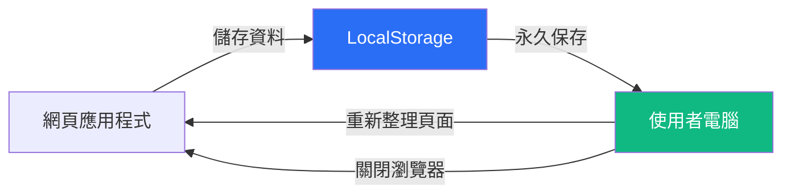

- 🔒 **儲存位置**：使用者的瀏覽器（客戶端）
- ♾️ **保存時間**：永久保存，除非手動刪除
- 💾 **容量限制**：約 5-10 MB（依瀏覽器而異）
- 🌐 **存取範圍**：同一網域（domain）內共用

### 生活化比喻

想像 LocalStorage 就像你家的**冰箱**：

- 📝 你可以把東西放進冰箱（儲存資料）
- 🔍 隨時打開冰箱看裡面有什麼（讀取資料）
- 🗑️ 不要的東西可以丟掉（刪除資料）
- ❄️ 關掉冰箱門，東西還在裡面（關閉瀏覽器後資料仍保留）

---

## 為什麼要用 LocalStorage？

### 使用情境

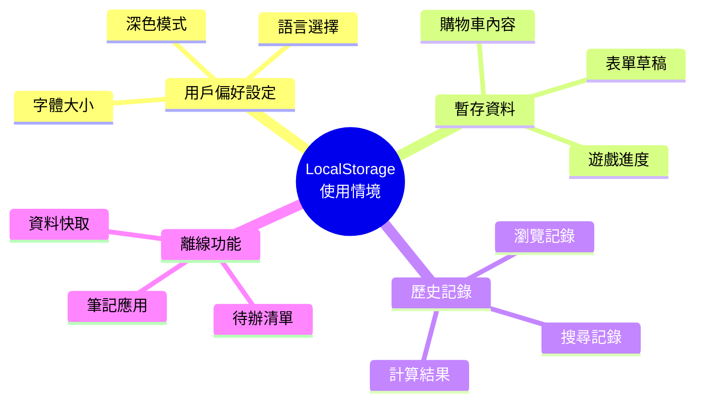

### 本專案實際應用

在狗狗歲數計算機中，我們使用 LocalStorage 來：

1. **儲存計算歷史**：最近 10 筆計算記錄
2. **保留最後結果**：重新整理頁面後自動還原
3. **提升使用體驗**：無需每次重新輸入

---

## LocalStorage vs 其他儲存方式

### 三種常見儲存方式比較

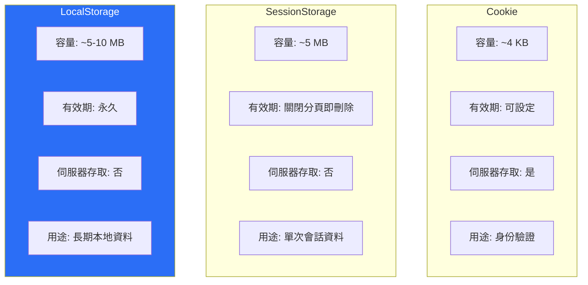

### 詳細對照表

| 特性 | LocalStorage | SessionStorage | Cookie |
|------|-------------|----------------|--------|
| 容量 | 5-10 MB | 5-10 MB | 4 KB |
| 有效期 | 永久 | 關閉分頁後刪除 | 可設定過期時間 |
| 存取方式 | JavaScript | JavaScript | JavaScript + HTTP |
| 伺服器存取 | ❌ | ❌ | ✅（自動帶在請求中） |
| 適用情境 | 長期資料、離線功能 | 暫時資料、表單暫存 | 登入憑證、追蹤 |

### 選擇建議

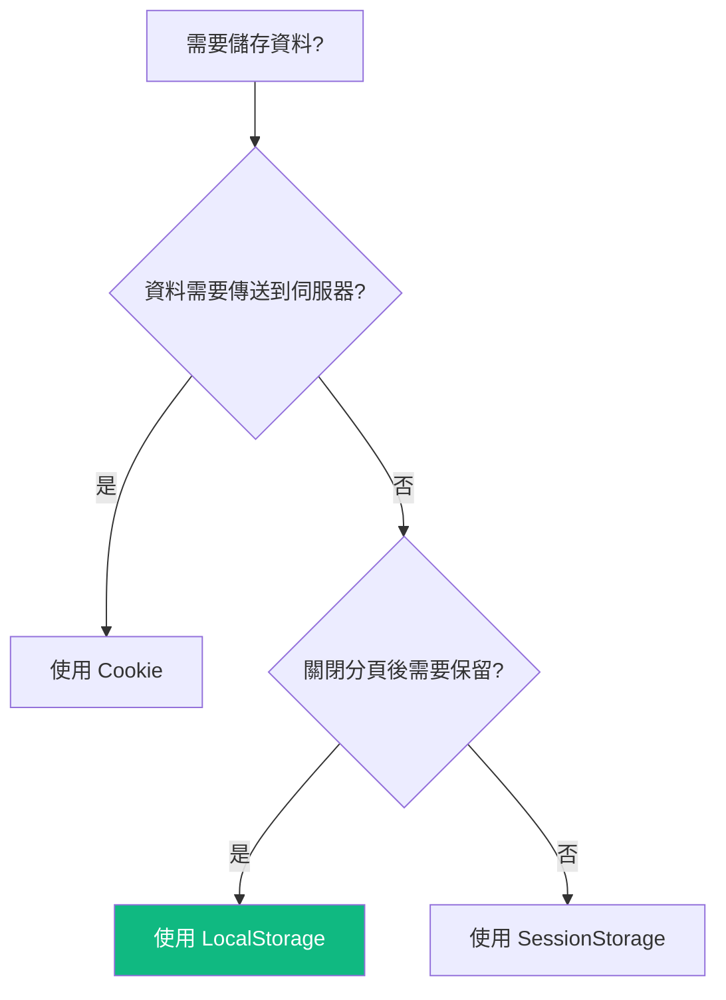

---

## 基本操作

LocalStorage 提供 4 個核心方法：

### 1. 儲存資料 - `setItem()`

```javascript
// 語法
localStorage.setItem('鍵名', '值');

// 範例
localStorage.setItem('userName', '小明');
localStorage.setItem('age', '25');
```

### 2. 讀取資料 - `getItem()`

```javascript
// 語法
const value = localStorage.getItem('鍵名');

// 範例
const userName = localStorage.getItem('userName');
console.log(userName); // 輸出：小明
```

### 3. 刪除資料 - `removeItem()`

```javascript
// 語法
localStorage.removeItem('鍵名');

// 範例
localStorage.removeItem('userName'); // 刪除 userName
```

### 4. 清空所有資料 - `clear()`

```javascript
// 清空所有 LocalStorage 資料
localStorage.clear();
```

### 運作流程圖

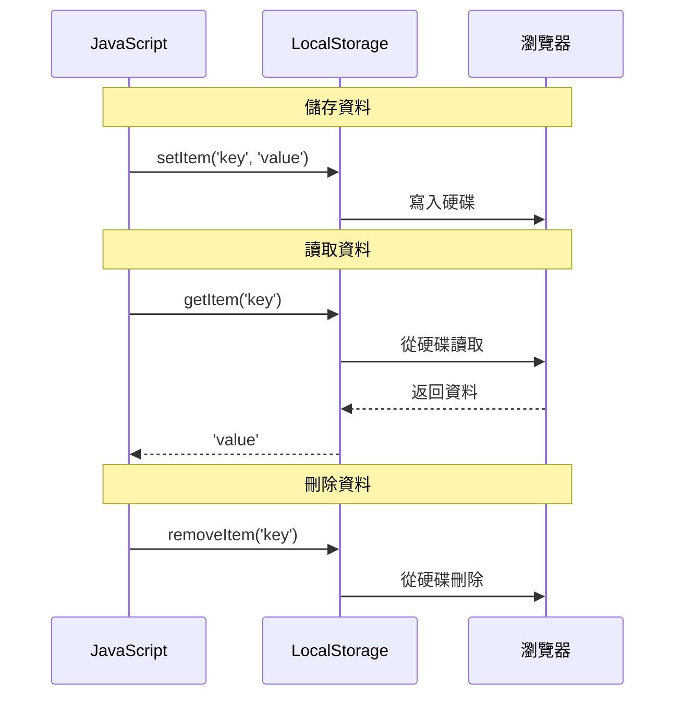

---

## 重要觀念

### ⚠️ 只能儲存字串

LocalStorage **只能儲存字串**（String），其他類型的資料需要轉換。

```javascript
// ❌ 錯誤示範：直接儲存物件
const user = { name: '小明', age: 25 };
localStorage.setItem('user', user);
// 結果：儲存成 "[object Object]"（無用的字串）

// ✅ 正確做法：使用 JSON.stringify() 轉換
const user = { name: '小明', age: 25 };
localStorage.setItem('user', JSON.stringify(user));
// 結果：儲存成 '{"name":"小明","age":25}'
```

### 🔄 JSON 序列化與反序列化

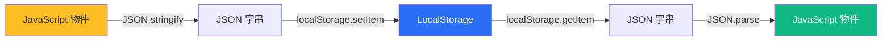

**完整範例**：

```javascript
// 1. 準備資料（物件）
const userData = {
  name: '小明',
  age: 25,
  hobbies: ['閱讀', '運動']
};

// 2. 序列化：物件 → JSON 字串
const jsonString = JSON.stringify(userData);
console.log(jsonString);
// 輸出：'{"name":"小明","age":25,"hobbies":["閱讀","運動"]}'

// 3. 儲存到 LocalStorage
localStorage.setItem('user', jsonString);

// 4. 從 LocalStorage 讀取
const storedString = localStorage.getItem('user');

// 5. 反序列化：JSON 字串 → 物件
const restoredUser = JSON.parse(storedString);
console.log(restoredUser.name); // 輸出：小明
console.log(restoredUser.hobbies[0]); // 輸出：閱讀
```

### 💾 容量限制

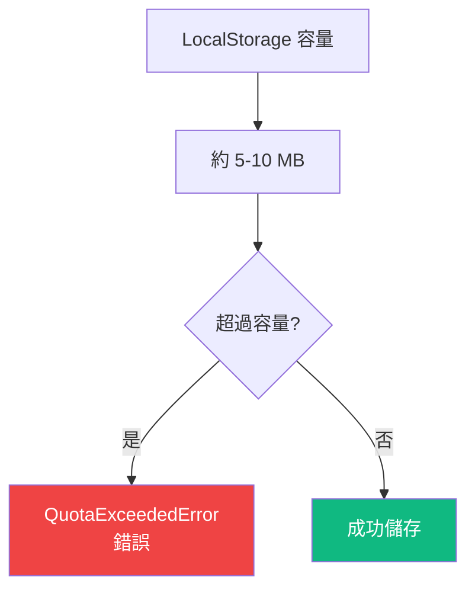

**不同瀏覽器的容量**：
- Chrome: 10 MB
- Firefox: 10 MB
- Safari: 5 MB
- Edge: 10 MB

### 🔒 安全性考量

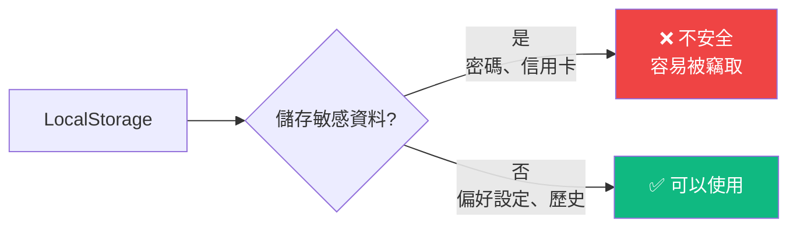

**注意事項**：
- ❌ **不要儲存**：密碼、信用卡號、個人身份證字號
- ✅ **可以儲存**：使用者偏好、非敏感歷史記錄、界面狀態

---

## 本專案應用實例

### 功能架構

本專案使用 LocalStorage 實現兩個主要功能：

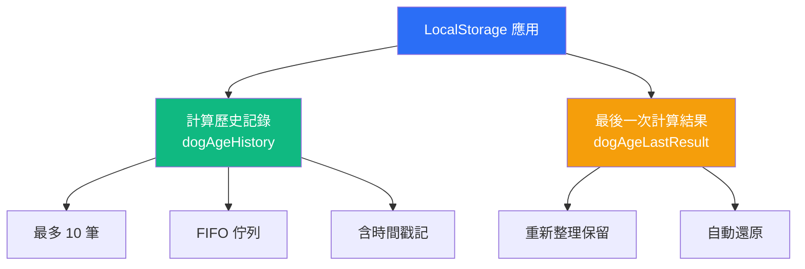

### 1. 計算歷史記錄

**資料結構**：

```javascript
// 單筆記錄的結構
{
  id: 1637123456789,              // 唯一識別碼（時間戳記）
  timestamp: "2025-01-15T10:30:00.000Z", // ISO 格式時間
  birthday: "2020-03-15",         // 狗狗生日
  dogAge: "4.8",                  // 狗齡（字串）
  humanAge: "55.2"                // 人類年齡（字串）
}

// 完整歷史記錄（陣列）
[
  { id: 1637123456789, timestamp: "2025-01-15T10:30:00.000Z", ... },
  { id: 1637123450000, timestamp: "2025-01-15T10:25:00.000Z", ... },
  // ... 最多 10 筆
]
```

**儲存流程**：

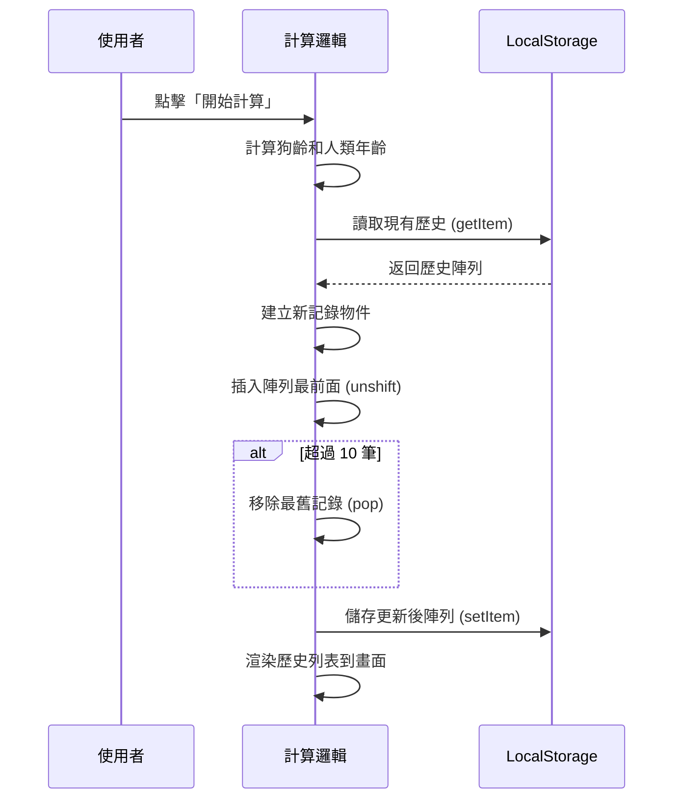

### 2. 最後一次結果保留

**資料結構**：

```javascript
{
  birthday: "2020-03-15",   // 狗狗生日
  dogAge: "4.8",            // 狗齡
  humanAge: "55.2"          // 人類年齡
}
```

**還原流程**：

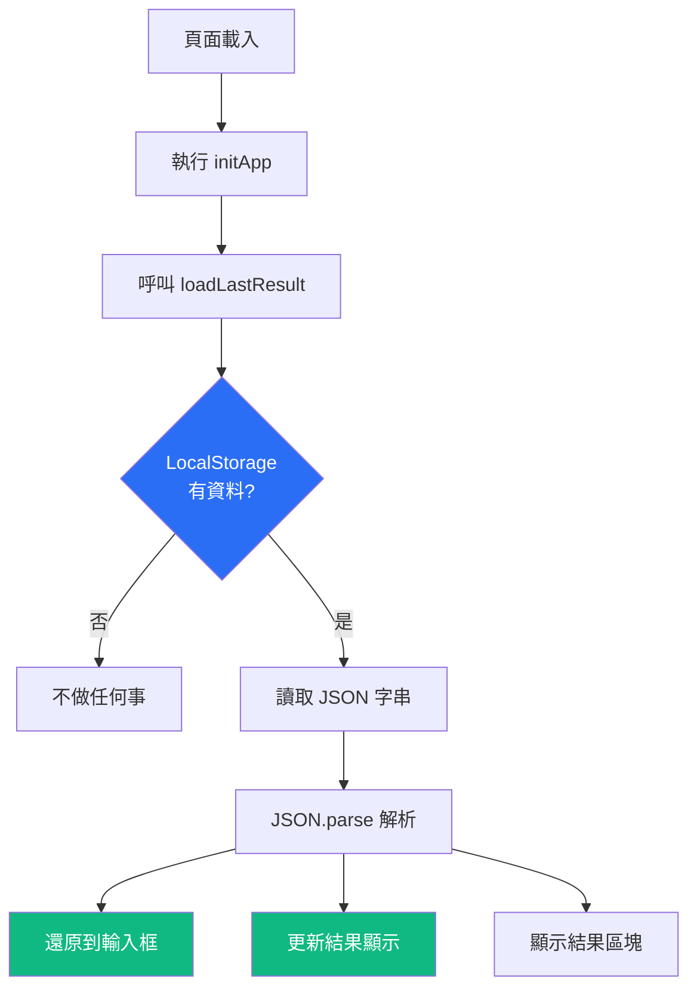

---

## 實戰演練

### 範例 1：儲存和讀取歷史記錄（完整程式碼）

#### 📝 程式碼（從專案提取）

```javascript
const STORAGE_KEY = 'dogAgeHistory';    // 儲存鍵名
const MAX_HISTORY_ITEMS = 10;           // 最多 10 筆

// ========== 讀取歷史記錄 ==========
function loadHistory() {
  try {
    // 1. 從 LocalStorage 讀取資料
    const data = localStorage.getItem(STORAGE_KEY);

    // 2. 如果有資料，解析 JSON；沒有則返回空陣列
    return data ? JSON.parse(data) : [];
  } catch (error) {
    // 3. 錯誤處理：解析失敗時返回空陣列
    console.error('讀取歷史記錄失敗：', error);
    return [];
  }
}

// ========== 儲存歷史記錄 ==========
function saveHistory(history) {
  try {
    // 1. 將陣列轉換成 JSON 字串
    const jsonString = JSON.stringify(history);

    // 2. 儲存到 LocalStorage
    localStorage.setItem(STORAGE_KEY, jsonString);
  } catch (error) {
    // 3. 錯誤處理：儲存失敗時提示使用者
    console.error('儲存歷史記錄失敗：', error);
    alert('儲存記錄失敗，可能是儲存空間不足。');
  }
}

// ========== 新增記錄（FIFO 佇列） ==========
function addHistoryItem(birthday, dogAge, humanAge) {
  // 1. 讀取現有歷史
  const history = loadHistory();

  // 2. 建立新記錄物件
  const newItem = {
    id: Date.now(),                      // 使用時間戳記作為唯一 ID
    timestamp: new Date().toISOString(), // ISO 格式時間
    birthday,                            // 狗狗生日
    dogAge: dogAge.toFixed(1),          // 狗齡（保留 1 位小數）
    humanAge: humanAge.toFixed(1)       // 人類年齡（保留 1 位小數）
  };

  // 3. 插入到陣列最前面（最新的在前）
  history.unshift(newItem);

  // 4. 限制最多 10 筆（移除最舊的）
  if (history.length > MAX_HISTORY_ITEMS) {
    history.pop(); // 移除陣列最後一個元素
  }

  // 5. 儲存更新後的歷史
  saveHistory(history);

  // 6. 重新渲染畫面
  renderHistory();
}

// ========== 清除所有記錄 ==========
function clearAllHistory() {
  // 1. 詢問使用者確認
  if (confirm('確定要清除所有計算記錄嗎？')) {
    // 2. 從 LocalStorage 刪除
    localStorage.removeItem(STORAGE_KEY);

    // 3. 重新渲染畫面（顯示空狀態）
    renderHistory();
  }
}
```

#### 🔍 逐步解說

**FIFO 佇列運作原理**：

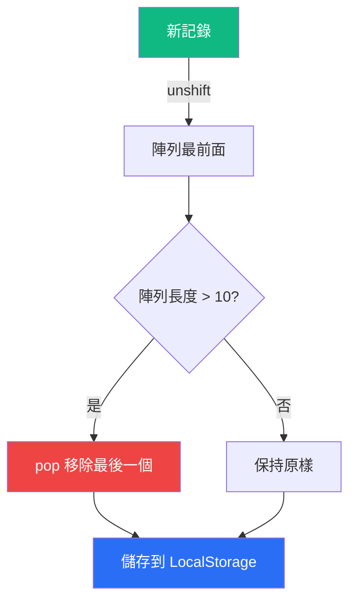

**FIFO（First In First Out）佇列示意**：

```
新增第 1 筆：[記錄1]
新增第 2 筆：[記錄2, 記錄1]
新增第 3 筆：[記錄3, 記錄2, 記錄1]
...
新增第 10 筆：[記錄10, 記錄9, ..., 記錄1]
新增第 11 筆：[記錄11, 記錄10, ..., 記錄2]  ← 記錄1 被移除
```

### 範例 2：儲存和還原最後結果

#### 📝 程式碼

```javascript
const LAST_RESULT_KEY = 'dogAgeLastResult'; // 儲存鍵名

// ========== 儲存最後一次計算結果 ==========
function saveLastResult(birthday, dogAge, humanAge) {
  try {
    // 1. 建立結果物件
    const lastResult = {
      birthday,
      dogAge: dogAge.toFixed(1),
      humanAge: humanAge.toFixed(1)
    };

    // 2. 轉換成 JSON 字串並儲存
    localStorage.setItem(LAST_RESULT_KEY, JSON.stringify(lastResult));
  } catch (error) {
    console.error('儲存最後結果失敗：', error);
  }
}

// ========== 讀取並還原最後一次計算結果 ==========
function loadLastResult() {
  try {
    // 1. 從 LocalStorage 讀取資料
    const data = localStorage.getItem(LAST_RESULT_KEY);

    // 2. 如果沒有資料，直接返回
    if (!data) return;

    // 3. 解析 JSON 字串
    const lastResult = JSON.parse(data);

    // 4. 還原到輸入框
    document.getElementById('birthday').value = lastResult.birthday;

    // 5. 更新結果顯示
    document.getElementById('dogAge').textContent = lastResult.dogAge;
    document.getElementById('humanAge').textContent = lastResult.humanAge;

    // 6. 顯示結果區塊
    document.getElementById('result').classList.remove('hidden');

    // 7. 顯示幼犬提示（如果適用）
    if (parseFloat(lastResult.dogAge) < 1) {
      document.getElementById('note').textContent =
        '註：幼犬成長迅速，換算為人類年齡只是估算值。';
    } else {
      document.getElementById('note').textContent = '';
    }
  } catch (error) {
    console.error('讀取最後結果失敗：', error);
  }
}

// ========== 初始化時自動載入 ==========
function initApp() {
  // 啟動圖片輪播
  startImageRotation();

  // 渲染歷史記錄
  renderHistory();

  // 還原最後一次計算結果 ✨
  loadLastResult();

  console.log('🐶 狗狗歲數計算機已啟動！');
}
```

#### 🔍 還原流程圖

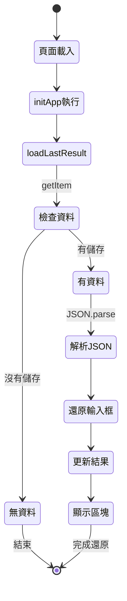

---

## 常見問題

### ❓ Q1：LocalStorage 的資料會消失嗎？

**A**：正常情況下不會，除非：
- 使用者手動清除瀏覽器資料
- 程式碼執行 `localStorage.clear()` 或 `removeItem()`
- 瀏覽器隱私模式（無痕模式）關閉後會刪除

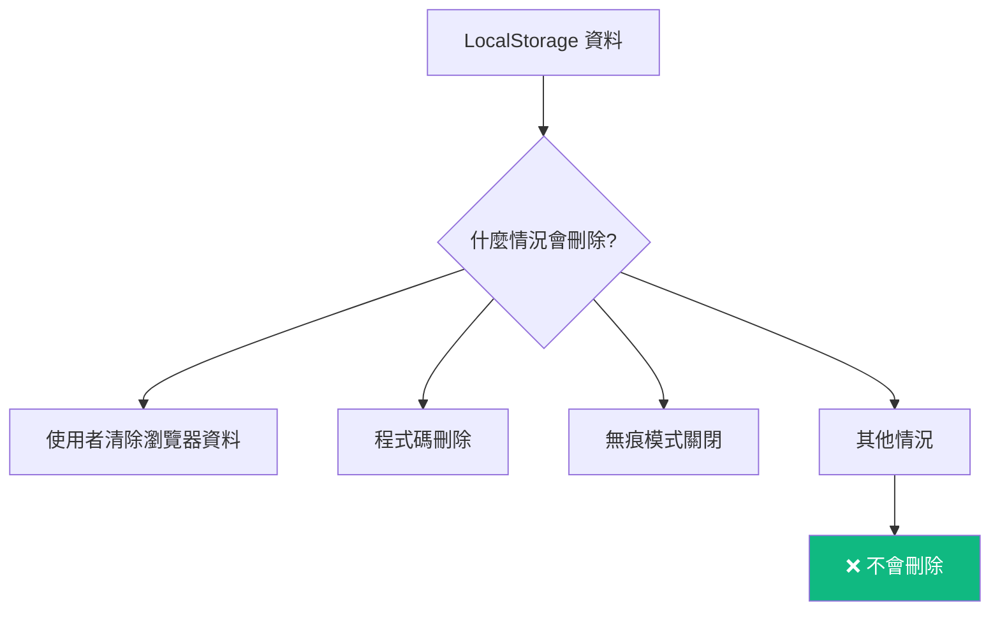

### ❓ Q2：為什麼要用 try-catch？

**A**：防止以下錯誤導致程式崩潰：

```javascript
// 可能的錯誤情況
try {
  // 1. 容量超限錯誤
  localStorage.setItem('key', 'huge data...'); // QuotaExceededError

  // 2. JSON 解析錯誤
  const data = JSON.parse('這不是有效的 JSON'); // SyntaxError

  // 3. 瀏覽器不支援（極少見）
  localStorage.setItem('key', 'value'); // TypeError
} catch (error) {
  console.error('發生錯誤：', error);
  // 顯示友善的錯誤訊息給使用者
}
```

**錯誤處理流程**：

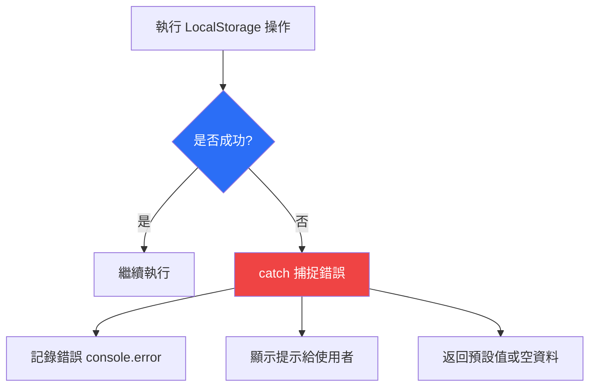

### ❓ Q3：如何檢查 LocalStorage 有沒有資料？

**A**：有三種方法：

```javascript
// 方法 1：使用 getItem 檢查
const data = localStorage.getItem('myKey');
if (data) {
  console.log('有資料');
} else {
  console.log('沒有資料');
}

// 方法 2：使用 in 運算子（較少用）
if ('myKey' in localStorage) {
  console.log('鍵存在');
}

// 方法 3：檢查陣列長度（歷史記錄）
const history = JSON.parse(localStorage.getItem('history') || '[]');
if (history.length > 0) {
  console.log(`有 ${history.length} 筆記錄`);
}
```

### ❓ Q4：LocalStorage 可以存圖片嗎？

**A**：理論上可以（轉成 Base64），但**不建議**：

```javascript
// ⚠️ 不建議：會佔用大量空間
const imageBase64 = 'data:image/png;base64,iVBORw0KGgoAAAANS...'; // 很長
localStorage.setItem('image', imageBase64);

// ✅ 建議：只存圖片 URL
localStorage.setItem('imageUrl', 'https://example.com/dog.jpg');
```

**原因**：
- 圖片檔案很大，容易超過 5-10 MB 限制
- 會拖慢讀寫速度
- 更好的做法：存 URL 或使用 IndexedDB

---

## 最佳實踐

### ✅ 1. 統一管理鍵名

```javascript
// ✅ 好的做法：使用常數管理
const STORAGE_KEYS = {
  HISTORY: 'dogAgeHistory',
  LAST_RESULT: 'dogAgeLastResult',
  USER_SETTINGS: 'userSettings'
};

localStorage.setItem(STORAGE_KEYS.HISTORY, data);

// ❌ 不好的做法：散落各處的字串
localStorage.setItem('dogAgeHistory', data);  // 容易打錯字
localStorage.setItem('dogagehistory', data2); // 拼字不一致
```

### ✅ 2. 封裝讀寫函式

```javascript
// ✅ 好的做法：封裝成可重複使用的函式
function saveToStorage(key, value) {
  try {
    const jsonString = JSON.stringify(value);
    localStorage.setItem(key, jsonString);
    return true;
  } catch (error) {
    console.error(`儲存 ${key} 失敗：`, error);
    return false;
  }
}

function loadFromStorage(key, defaultValue = null) {
  try {
    const data = localStorage.getItem(key);
    return data ? JSON.parse(data) : defaultValue;
  } catch (error) {
    console.error(`讀取 ${key} 失敗：`, error);
    return defaultValue;
  }
}

// 使用
saveToStorage('user', { name: '小明' });
const user = loadFromStorage('user', { name: '訪客' });
```

### ✅ 3. 資料驗證

```javascript
function loadHistory() {
  try {
    const data = localStorage.getItem(STORAGE_KEY);
    if (!data) return [];

    const history = JSON.parse(data);

    // ✅ 驗證資料格式
    if (!Array.isArray(history)) {
      console.warn('歷史記錄格式錯誤，已重置');
      return [];
    }

    // ✅ 驗證每筆記錄的完整性
    return history.filter(item =>
      item.id &&
      item.timestamp &&
      item.birthday &&
      item.dogAge &&
      item.humanAge
    );
  } catch (error) {
    console.error('讀取歷史記錄失敗：', error);
    return [];
  }
}
```

### ✅ 4. 容量管理

```javascript
// 檢查剩餘容量（估算）
function checkStorageSize() {
  let totalSize = 0;
  for (let key in localStorage) {
    if (localStorage.hasOwnProperty(key)) {
      totalSize += localStorage[key].length + key.length;
    }
  }

  const sizeInMB = (totalSize / 1024 / 1024).toFixed(2);
  console.log(`LocalStorage 使用量：${sizeInMB} MB`);

  return totalSize;
}

// 定期清理舊資料
function cleanupOldData() {
  const history = loadHistory();

  // 只保留 30 天內的記錄
  const thirtyDaysAgo = Date.now() - (30 * 24 * 60 * 60 * 1000);

  const filteredHistory = history.filter(item =>
    new Date(item.timestamp).getTime() > thirtyDaysAgo
  );

  saveHistory(filteredHistory);
}
```

### ✅ 5. 命名規範

```javascript
// ✅ 好的命名：清楚描述用途
const USER_PREFERENCES = 'userPreferences';
const SHOPPING_CART = 'shoppingCart';
const GAME_PROGRESS = 'gameProgress';

// ❌ 不好的命名：難以理解
const DATA = 'data';
const TEMP = 'temp';
const X = 'x';
```

---

## 實戰練習題

### 練習 1：待辦清單

建立一個簡單的待辦清單應用：

```javascript
// TODO：實作以下功能
// 1. 新增待辦事項
// 2. 儲存到 LocalStorage
// 3. 頁面重新整理後自動載入
// 4. 刪除待辦事項

const TODO_KEY = 'todoList';

function addTodo(text) {
  // 你的程式碼
}

function loadTodos() {
  // 你的程式碼
}

function deleteTodo(id) {
  // 你的程式碼
}
```

<details>
<summary>💡 點擊查看參考解答</summary>

```javascript
const TODO_KEY = 'todoList';

function addTodo(text) {
  const todos = loadTodos();

  const newTodo = {
    id: Date.now(),
    text: text,
    completed: false,
    createdAt: new Date().toISOString()
  };

  todos.push(newTodo);

  localStorage.setItem(TODO_KEY, JSON.stringify(todos));
  return newTodo;
}

function loadTodos() {
  try {
    const data = localStorage.getItem(TODO_KEY);
    return data ? JSON.parse(data) : [];
  } catch (error) {
    console.error('載入失敗：', error);
    return [];
  }
}

function deleteTodo(id) {
  const todos = loadTodos();
  const filteredTodos = todos.filter(todo => todo.id !== id);
  localStorage.setItem(TODO_KEY, JSON.stringify(filteredTodos));
}

// 使用範例
addTodo('學習 LocalStorage');
addTodo('完成專案');
console.log(loadTodos());
```

</details>

### 練習 2：使用者偏好設定

實作深色模式切換功能：

```javascript
// TODO：實作深色模式開關
// 1. 儲存使用者選擇的主題（light/dark）
// 2. 頁面載入時自動套用主題
// 3. 切換主題時更新 LocalStorage

function saveTheme(theme) {
  // 你的程式碼
}

function loadTheme() {
  // 你的程式碼
}

function toggleTheme() {
  // 你的程式碼
}
```

---

## 總結

### 🎯 重點回顧

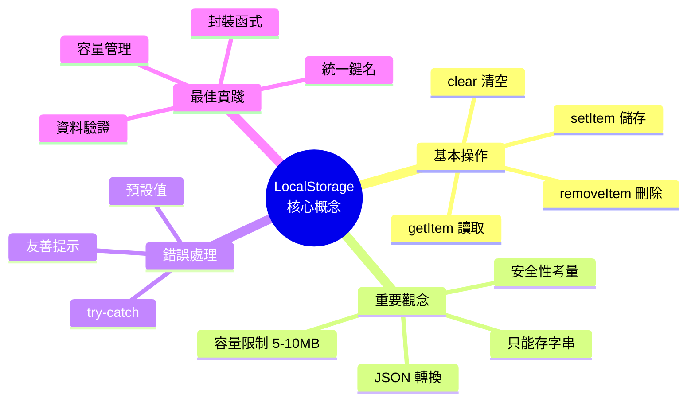

### 📚 學習路徑

1. ✅ **理解基本概念**：什麼是 LocalStorage、為什麼用
2. ✅ **掌握基本操作**：setItem、getItem、removeItem、clear
3. ✅ **學會 JSON 轉換**：stringify、parse
4. ✅ **實作錯誤處理**：try-catch、預設值
5. ✅ **應用到專案**：歷史記錄、使用者偏好
6. 🎓 **進階學習**：IndexedDB、快取策略

### 🔗 延伸閱讀

- [MDN - LocalStorage](https://developer.mozilla.org/zh-TW/docs/Web/API/Window/localStorage)
- [MDN - JSON](https://developer.mozilla.org/zh-TW/docs/Web/JavaScript/Reference/Global_Objects/JSON)
- [Web Storage API](https://developer.mozilla.org/zh-TW/docs/Web/API/Web_Storage_API)

---

<div align="center">

**🎉 恭喜你完成 LocalStorage 學習！**

現在你可以開始在自己的專案中使用 LocalStorage 了！

**[⬆ 回到頂部](#-localstorage-完整指南)**

</div>
